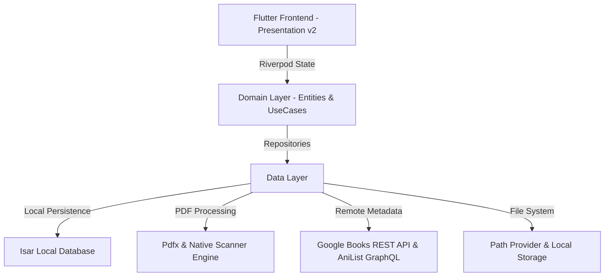

# 🚀 BookShelf — Executable Implementation Plan

This comprehensive implementation plan outlines all architectural, design, engineering, testing, and deployment tasks required to transform **BookShelf** from its current prototype state into a production-ready, high-performance local PDF organizer, smart ebook reader, and document management platform.

---

## 📌 Executive Summary & Product Vision

**BookShelf** is a local-first, privacy-focused PDF organizer and ebook reader featuring a modern interface (v2 Light & Dark themes). It automatically scans, classifies (into categories such as *Work*, *Personal*, *Receipts*, *Signed*, *Shared*, *Manga*, *Textbooks*), fetches high-resolution metadata cover posters, and allows users to read, scan, import, merge, and organize PDFs seamlessly.

---

## 🔍 Codebase Audit & Gap Analysis

Based on an audit of `lib/`, `pubspec.yaml`, and `Mock Design/bookshelf-home-concepts.html`, the current system status is as follows:

| Component | Current State | Required Target State |
| :--- | :--- | :--- |
| **Home Screen UI** | Basic Netflix dark prototype with hardcoded cards (`home_screen.dart`). | **v2 Dual-Theme Interface** matching `bookshelf-home-concepts.html` (Light/Dark themes, 4 Quick Actions, 5 Vertical Shelves, 2-Column Bento Grid, Floating Nav). |
| **State Management** | Hardcoded `StatefulWidget` state. | **Riverpod 2.x Architecture** (`NotifierProvider`, `AsyncNotifierProvider`) for theme, library state, search, and reading progress. |
| **Local Database** | Dependency declared (`isar`), no schema defined. | **Isar Database Schemas** for local persistence of books, categories, reading progress, shelf groupings, and cached metadata. |
| **PDF Processing** | Dependencies declared (`pdfx`, `image`), basic heuristics entity. | **Full PDF Engine**: Page 1 cover thumbnail rendering, text extraction, page density calculation, and high-performance PDF Viewer screen. |
| **Document Actions** | Placeholder buttons. | **Interactive Engines**: Camera Scanner engine, Document Import picker, PDF Merge engine, and Folder/Shelf creation modal. |
| **Metadata Pipeline** | Datasources exist (`google_books_datasource.dart`, `anilist_manga_datasource.dart`). | **Repository Pipeline**: Caching layer, offline fallback to PDF Page 1 image, and metadata editor dialog. |
| **Routing** | Single screen embedded in wrapper (`main.dart`). | **GoRouter Integration**: Declarative routing for `/home`, `/scanner`, `/reader/:id`, `/search`, `/settings`, `/shelf/:id`. |

---

## 🛠️ System Architecture

---

## 📋 Comprehensive Implementation Roadmap

### Phase 1: Frontend Development (Flutter UI v2)

#### 1.1 Theme & Design Token System
- [x] Create `lib/core/theme/app_theme.dart` defining complete Light and Dark theme tokens matching `bookshelf-home-concepts.html`:
  - **Light Palette**: Canvas `#FAFAFB`, Cards `#FFFFFF`, Search `#EFEFEF`, Nav `#FFFFFF`, Nav Active `#1C1C1E`.
  - **Dark Palette**: Canvas `#111113`, Cards `#1A1A1E`, Search `#1C1C20`, Nav `#141416`, Nav Active `#FFFFFF`.
  - **Vertical Shelf Gradients**:
    - *Work*: Light (`#BACFFF` $\rightarrow$ `#9EB8FF`) / Dark (`#1C274C` $\rightarrow$ `#151D38`).
    - *Personal*: Light (`#ECCFFF` $\rightarrow$ `#D8A9FB`) / Dark (`#2E1B4E` $\rightarrow$ `#201237`).
    - *Receipts*: Light (`#95F0DB` $\rightarrow$ `#68E0C4`) / Dark (`#123F36` $\rightarrow$ `#0B2B25`).
    - *Signed*: Light (`#BDCFFF` $\rightarrow$ `#9FB8FF`) / Dark (`#222B4E` $\rightarrow$ `#161D36`).
    - *Shared*: Light (`#FFC4E7` $\rightarrow$ `#FFA1D6`) / Dark (`#4A1A37` $\rightarrow$ `#331025`).

#### 1.2 Home Screen Component Reconstruction (`lib/features/home_library/presentation/screens/home_screen.dart`)
- [x] **Header Bar Widget** (`app_header_widget.dart`): Dynamic `SCAN READY` status tag (Dark mode), `Bookshelf` title, theme toggle button, and circular user profile avatar.
- [x] **Search Bar Widget** (`search_bar_widget.dart`): Interactive search field with instant filtering.
- [x] **Quick Action Grid Widget** (`quick_actions_widget.dart`):
  - `Scan`: Triggers camera document scanner flow.
  - `Import`: Opens system file picker.
  - `Merge`: Opens PDF selection and merge workflow.
  - `New`: Displays new shelf creation modal.
- [x] **`YOUR SHELVES` Vertical Spine Row** (`shelves_row_widget.dart`):
  - 5 vertical shelf cards (`Work`, `Personal`, `Receipts`, `Signed`, `Shared`) with item count badges.
- [x] **`RECENT` Bento Grid** (`recent_bento_grid.dart`):
  - 2-column grid of document cards with page 1 preview box, status indicator dot, document title, and formatted subtext (`1.1 MB • 9p`).
- [x] **Floating Bottom Navigation Bar** (`bottom_nav_bar_widget.dart`):
  - 4 Navigation items: Home (`🏠`), Folders (`📁`), Search (`🔍`), Settings (`⚙`).

#### 1.3 High-Performance PDF Reader Screen (`lib/features/pdf_reader/presentation/screens/pdf_reader_screen.dart`)
- [ ] Implement `pdfx` widget for horizontal and vertical continuous page scrolling.
- [ ] Pinch-to-zoom, page jump input slider, bookmarking, and thumbnail drawer.
- [ ] Auto-save reading position (current page / total pages) on exit and backgrounding.

---

### Phase 2: Local Database & Storage Layer

#### 2.1 Isar Database Schemas (`lib/core/database/`)
- [ ] **`BookCollection` Schema**:
  - Fields: `id`, `filePath`, `title`, `authors`, `category`, `coverPath`, `fileSizeBytes`, `pageCount`, `currentPage`, `lastReadTimestamp`, `isPinned`, `shelfId`, `isScanned`.
- [ ] **`ShelfCollection` Schema**:
  - Fields: `id`, `name`, `colorHex`, `iconName`, `itemCount`, `createdAt`.
- [ ] **`ReadingProgressCollection` Schema**:
  - Fields: `bookId`, `lastPage`, `readingDurationSeconds`, `updatedAt`.

#### 2.2 Local File Scanner & Thumbnail Generator (`lib/features/storage_organizer/`)
- [ ] Implement background folder scanner using `permission_handler` and `file_picker`.
- [ ] Extract page 1 of imported PDFs via `pdfx` and render high-resolution PNG cover thumbnail to application cache directory (`path_provider`).

---

### Phase 3: Backend & External Integrations

#### 3.1 Metadata Enrichment Pipeline (`lib/features/metadata_enrichment/`)
- [ ] **Google Books REST API**: Fetch title, authors, description, and high-res cover URL.
- [ ] **AniList GraphQL API**: Fetch manga / light novel volume info, anime cover art, and Japanese titles.
- [ ] **Caching & Offline Fallback**: Store API responses in local database; fallback gracefully to generated PDF Page 1 image if offline.

#### 3.2 Cloud Sync & Backup Backend Architecture (Optional Extension)
- [ ] Design Supabase / REST backend sync schema for cross-device reading progress and shelf metadata sync.

---

### Phase 4: Document Utilities (Scan & Merge Engines)

#### 4.1 Document Scanner Engine (`lib/features/document_scanner/`)
- [ ] Native camera capture flow for scanning physical paper documents.
- [ ] Perspective transformation, contrast enhancement, and PDF synthesis.

#### 4.2 PDF Merge Engine (`lib/features/pdf_editor/`)
- [ ] Multi-select UI for selecting two or more PDFs.
- [ ] Order rearrangement interface.
- [ ] Merge execution using Dart PDF utilities into a single combined output file.

---

### Phase 5: Testing & Quality Assurance

#### 5.1 Unit Tests (`test/unit/`)
- [ ] Test heuristic PDF classification logic across sample text density inputs.
- [ ] Test Isar database CRUD operations and shelf query filters.
- [ ] Test metadata API mappers and fallback handling.

#### 5.2 Widget & Theme Tests (`test/widget/`)
- [ ] Verify light and dark theme token applications on `HomeScreen`.
- [ ] Verify search filter responsiveness and bento grid layout rendering.

#### 5.3 End-to-End Integration Tests (`test/integration/`)
- [ ] Verify end-to-end flow: File import $\rightarrow$ classification $\rightarrow$ thumbnail rendering $\rightarrow$ database save $\rightarrow$ reader launch.

---

### Phase 6: Deployment & Build Pipeline

#### 6.1 Android Deployment
- [ ] Configure `android/app/build.gradle` (minSdkVersion 21, targetSdkVersion 34).
- [ ] Set up keystore signing configuration for release builds.
- [ ] Generate APK (`flutter build apk --release`) and App Bundle (`flutter build appbundle`).

#### 6.2 iOS Deployment
- [ ] Configure `ios/Runner.xcworkspace` with app icon sets and permissions (`NSCameraUsageDescription`, `NSPhotoLibraryUsageDescription`).
- [ ] Build release archive for TestFlight (`flutter build ipa --release`).

#### 6.3 Web PWA Deployment
- [ ] Optimize web engine build (`flutter build web --release --web-renderer canvaskit`).
- [ ] Configure PWA `manifest.json` and service worker for offline web viewing.

---

## 🎯 Verification Criteria & Milestones

1. **Milestone 1**: Complete v2 Light & Dark Theme UI implementation matching HTML mockup (`HomeScreen` & widgets).
2. **Milestone 2**: Isar database integration and local storage scanning active.
3. **Milestone 3**: PDF Reader screen functional with reading progress persistence.
4. **Milestone 4**: Metadata enrichment (Google Books + AniList) and document utilities (Scan & Merge) fully operational.
5. **Milestone 5**: 100% passing test suite and automated release builds (Android APK, iOS IPA, Web PWA).
